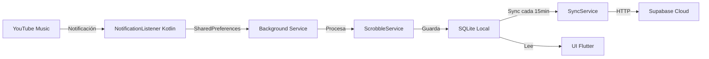

# 🎵 YTM Scrobbler

<div align="center">

**Aplicación Android para registrar y sincronizar tu historial de reproducción de YouTube Music**

[](https://flutter.dev)
[](https://dart.dev)
[](https://openjdk.org/)
[](LICENSE)

[Características](#-características) •
[Instalación](#-instalación) •
[Uso](#-uso) •
[Arquitectura](#-arquitectura) •
[Desarrollo](#-desarrollo)

</div>

---

## 📋 Descripción

YTM Scrobbler es una aplicación Android nativa construida con Flutter que detecta automáticamente la música que estás reproduciendo en YouTube Music y registra cada canción (scrobble) en una base de datos local. Los datos se sincronizan automáticamente con Supabase en la nube, permitiéndote mantener un historial completo de tu música.

### ¿Qué es Scrobbling?

Scrobbling es el proceso de rastrear la música que escuchas y enviar esa información a un servicio para crear un historial de reproducción. Esta app te permite:

- 📊 Ver estadísticas de tu música favorita
- 🔄 Mantener un historial sincronizado en la nube
- 🎯 Descubrir patrones en tus hábitos musicales
- 💾 Backup automático de tu historial de reproducción

## ✨ Características

### 🎧 Detección Automática
- **Monitoreo en tiempo real** de YouTube Music mediante permisos de notificaciones
- **Detección inteligente** de cambios de canción
- **Enriquecimiento de metadatos** (título, artista, álbum, duración)
- **Servicio en segundo plano** persistente incluso después de reiniciar el dispositivo

### 💾 Persistencia de Datos
- **Base de datos local SQLite** con almacenamiento eficiente
- **Sincronización automática** con Supabase cada 15 minutos
- **Manejo de conflictos** y prevención de duplicados
- **Limpieza automática** de scrobbles antiguos (>30 días)

### 🎨 Interfaz de Usuario
- **Material Design 3** con Material You (colores dinámicos del sistema)
- **Modo oscuro/claro** automático
- **Pull-to-refresh** para sincronización manual
- **Indicadores visuales** de estado de sincronización
- **Pantalla de configuración** intuitiva

### 🔄 Sincronización Robusta
- **Retry automático** con exponential backoff
- **Sincronización offline** (se sincroniza cuando hay conexión)
- **Detección de red** antes de sincronizar
- **Workmanager** para tareas periódicas en background

### 🔔 Servicios en Segundo Plano
- **Foreground Service** para monitoreo continuo
- **Watchdog** con AlarmManager para reinicio automático
- **Restart Service** que se recupera de "Clear All"
- **Optimizado para Android 14+**

## 🚀 Instalación

### Requisitos Previos

- **Flutter SDK** 3.10.1 o superior
- **Dart SDK** 3.10.1 o superior
- **Android Studio** o VS Code con extensiones de Flutter
- **JDK 21** (se configura automáticamente con Gradle)
- **Cuenta de Supabase** (gratis) - [Regístrate aquí](https://supabase.com)

### Pasos de Instalación

1. **Clonar el repositorio**
   ```bash
   git clone https://github.com/tu-usuario/scrobbler.git
   cd scrobbler
   ```

2. **Instalar dependencias**
   ```bash
   flutter pub get
   ```

3. **Configurar Supabase**
   
   a. Crea un proyecto en [Supabase](https://supabase.com)
   
   b. Crea la tabla `scrobbles` con este SQL:
   ```sql
   CREATE TABLE scrobbles (
     id BIGSERIAL PRIMARY KEY,
     track TEXT NOT NULL,
     artist TEXT NOT NULL,
     album TEXT NOT NULL,
     duration INTEGER NOT NULL,
     timestamp TIMESTAMPTZ NOT NULL,
     created_at TIMESTAMPTZ DEFAULT NOW()
   );

   -- Índices para mejor rendimiento
   CREATE INDEX idx_scrobbles_timestamp ON scrobbles(timestamp DESC);
   CREATE INDEX idx_scrobbles_artist ON scrobbles(artist);
   CREATE INDEX idx_scrobbles_track ON scrobbles(track);
   ```
   
   c. Actualiza las credenciales en `lib/config/app_config.dart`:
   ```dart
   static const String supabaseUrl = 'TU_URL_DE_SUPABASE';
   static const String supabaseAnonKey = 'TU_ANON_KEY_DE_SUPABASE';
   ```

4. **Compilar y ejecutar**
   ```bash
   flutter run
   ```

## 📱 Uso

### Primera Configuración

1. **Instala la aplicación** en tu dispositivo Android
2. **Abre la app** y ve a "Configuración" (⚙️)
3. **Presiona "Abrir Configuración del Sistema"**
4. **Busca "YTM Scrobbler"** o "scrobbler" en la lista
5. **Activa el permiso** de acceso a notificaciones
6. **Regresa a la app** y verifica que el estado sea "✅ Servicio Activo"

### Uso Diario

Una vez configurado:

1. **Reproduce música en YouTube Music** como siempre
2. **La app detectará automáticamente** las canciones
3. **Los scrobbles aparecerán** en la lista principal después de 30 segundos
4. **La sincronización es automática** cada 15 minutos
5. Puedes **sincronizar manualmente** usando el botón de nube (☁️)

### Indicadores de Estado

- 🟢 **Verde con ✓**: Scrobble sincronizado con Supabase
- 🔵 **Azul con nube**: Scrobble pendiente de sincronización
- 🔴 **Banner naranja**: Servicio desactivado, requiere configuración

## 🏗️ Arquitectura

### Estructura del Proyecto

```
scrobbler/
├── android/                    # Configuración Android nativa
│   ├── app/
│   │   ├── src/main/kotlin/   # Código Kotlin para NotificationListener
│   │   └── build.gradle.kts   # Java 21, compileSdk 34
│   └── build.gradle.kts
├── lib/
│   ├── config/
│   │   └── app_config.dart    # 🔧 Configuración centralizada
│   ├── database/
│   │   └── db_helper.dart     # 💾 SQLite operations
│   ├── models/
│   │   └── scrobble.dart      # 📦 Modelo de datos
│   ├── pages/
│   │   └── settings_page.dart # ⚙️ Pantalla de configuración
│   ├── services/
│   │   ├── background_service_entry.dart  # 🔄 Entry point del background
│   │   ├── scrobble_service.dart          # 🎵 Lógica de scrobbling
│   │   ├── service_initializer.dart       # 🚀 Inicialización de servicios
│   │   └── sync_service.dart              # ☁️ Sincronización con Supabase
│   └── main.dart              # 🎯 Entry point principal
├── pubspec.yaml               # 📦 Dependencias
└── README.md                  # 📖 Este archivo
```

### Flujo de Datos



### Componentes Principales

#### 1. **NotificationListenerService (Kotlin)**
Servicio nativo Android que escucha notificaciones de YouTube Music y las envía a Flutter mediante SharedPreferences.

#### 2. **Background Service (Flutter)**
Servicio en foreground que procesa la cola de notificaciones cada 2 segundos y mantiene la app viva.

#### 3. **ScrobbleService**
Lógica de negocio que:
- Detecta nuevas canciones
- Enriquece metadatos
- Espera 30 segundos antes de guardar (requisito de scrobbling)
- Calcula duración de reproducción

#### 4. **DBHelper (SQLite)**
Gestiona la base de datos local:
- Previene duplicados con constraint UNIQUE
- Índices optimizados para búsquedas
- Manejo de migraciones de schema

#### 5. **SyncService**
Sincroniza con Supabase:
- Retry con exponential backoff
- Manejo de errores de red
- Solo sincroniza scrobbles no sincronizados

#### 6. **Workmanager**
Ejecuta sincronización periódica incluso cuando la app está cerrada.

## 🛠️ Tecnologías

### Frontend
- **Flutter 3.10.1+** - Framework UI multiplataforma
- **Dart 3.10.1+** - Lenguaje de programación
- **Material Design 3** - Sistema de diseño moderno

### Backend Local
- **SQLite (sqflite)** - Base de datos local
- **SharedPreferences** - Almacenamiento clave-valor

### Backend Cloud
- **Supabase** - Backend-as-a-Service (PostgreSQL + Auth + Realtime)

### Servicios Nativos (Android)
- **Kotlin** - NotificationListenerService
- **Java 21 LTS** - Runtime de Android
- **Gradle 8.11.1** - Build system

### Dependencias Principales

```yaml
dependencies:
  flutter_background_service: ^5.0.6  # Servicio en background
  flutter_local_notifications: ^18.0.1 # Notificaciones
  sqflite: ^2.3.0                      # Base de datos SQLite
  supabase_flutter: ^2.0.0             # Cliente Supabase
  workmanager: ^0.9.0+3                # Tareas periódicas
  dynamic_color: ^1.6.0                # Material You
  shared_preferences: ^2.3.5           # Persistencia simple
```

## 👨‍💻 Desarrollo

### Ejecutar en Modo Debug

```bash
flutter run
```

### Ver Logs en Tiempo Real

```bash
flutter logs
```

O con filtro específico:

```bash
adb logcat | grep -i "scrobbler"
```

### Análisis de Código

```bash
# Análisis estático
flutter analyze

# Formatear código
dart format lib/

# Ejecutar todos los fixes disponibles
dart fix --apply
```

### Build de Producción

```bash
# APK
flutter build apk --release

# App Bundle (para Google Play)
flutter build appbundle --release
```

Los archivos generados están en:
- APK: `build/app/outputs/flutter-apk/app-release.apk`
- AAB: `build/app/outputs/bundle/release/app-release.aab`

### Debugging

#### Ver Estado de Servicios

```bash
adb shell dumpsys activity services | grep scrobbler
```

#### Ver Base de Datos SQLite

```bash
adb shell run-as com.example.scrobbler
cd app_flutter
sqlite3 scrobbles.db
.tables
SELECT * FROM scrobbles LIMIT 10;
```

#### Limpiar Datos de la App

```bash
flutter clean
adb uninstall com.example.scrobbler
flutter run
```

### Estructura de Commits

Usamos [Conventional Commits](https://www.conventionalcommits.org/):

```
feat: nueva funcionalidad
fix: corrección de bug
docs: cambios en documentación
style: formato, punto y coma faltante, etc
refactor: refactorización de código
test: agregar tests
chore: actualizar dependencias, configuración, etc
```

Ejemplo:
```bash
git commit -m "feat: agregar indicador de batería en configuración"
```

## 🐛 Solución de Problemas

### El servicio se detiene después de "Clear All"

✅ **Solucionado:** El app incluye:
- RestartService que se reinicia automáticamente
- Watchdog con AlarmManager
- AutoStart habilitado

### No detecta canciones

1. Verifica permisos en Configuración
2. Asegúrate de que YouTube Music está actualizado
3. Reinicia la app
4. Revisa logs: `flutter logs`

### Error de sincronización con Supabase

1. Verifica conexión a internet
2. Confirma credenciales en `app_config.dart`
3. Revisa que la tabla exista en Supabase
4. Consulta logs para errores específicos

### La app usa mucha batería

El servicio está optimizado con:
- Foreground Service de baja prioridad
- Polling cada 2 segundos (muy eficiente)
- Solo procesa cuando hay datos nuevos
- Sincronización cada 15 minutos (mínimo de Android)

## 📝 Configuración Avanzada

### Cambiar Intervalo de Sincronización

Edita `lib/config/app_config.dart`:

```dart
static const int syncIntervalMinutes = 15; // Cambiar a tu preferencia (mínimo 15)
```

### Cambiar Umbral de Scrobble

Por defecto es 30 segundos. Cambiar en `app_config.dart`:

```dart
static const int scrobbleThresholdSeconds = 30; // Cambiar según necesites
```

### Días de Retención de Scrobbles Locales

```dart
static const int cleanupDaysOld = 30; // Scrobbles sincronizados más antiguos se eliminan
```

## 🤝 Contribuir

Las contribuciones son bienvenidas! Por favor:

1. **Fork** el proyecto
2. Crea una **branch** para tu feature (`git checkout -b feature/AmazingFeature`)
3. **Commit** tus cambios (`git commit -m 'feat: add some AmazingFeature'`)
4. **Push** a la branch (`git push origin feature/AmazingFeature`)
5. Abre un **Pull Request**

### Guidelines

- Sigue el estilo de código existente
- Agrega tests cuando sea posible
- Actualiza documentación si es necesario
- Usa Conventional Commits

## 📄 Licencia

Este proyecto está bajo la Licencia MIT. Ver el archivo [LICENSE](LICENSE) para más detalles.

## 🙏 Agradecimientos

- [Flutter](https://flutter.dev) - Framework increíble
- [Supabase](https://supabase.com) - Backend simplificado
- [Material Design](https://m3.material.io/) - Sistema de diseño

## 📧 Contacto

¿Preguntas? ¿Sugerencias? Abre un [issue](https://github.com/tu-usuario/scrobbler/issues)

---

<div align="center">

**Hecho con ❤️ y ☕ usando Flutter**

[⬆ Volver arriba](#-ytm-scrobbler)

</div>
